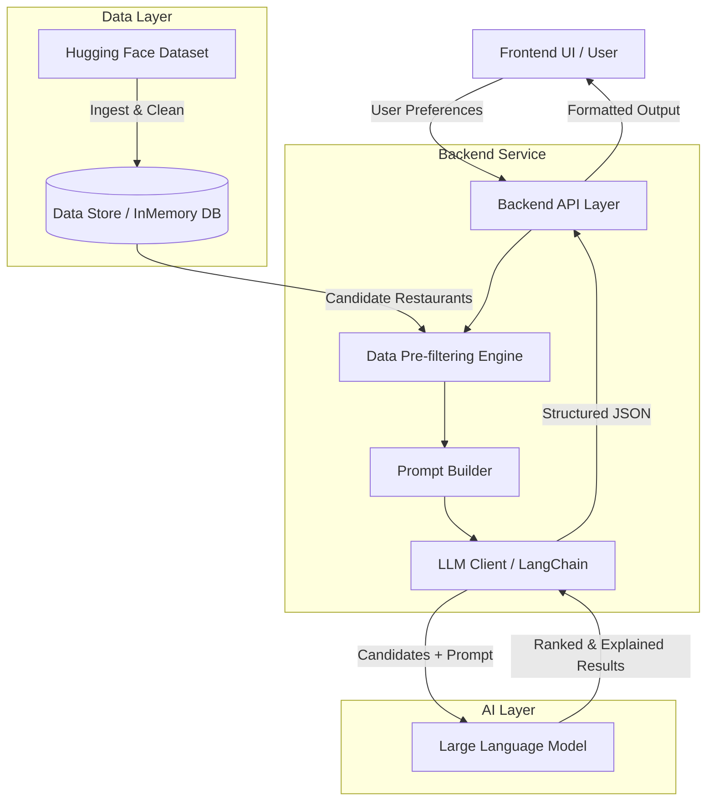
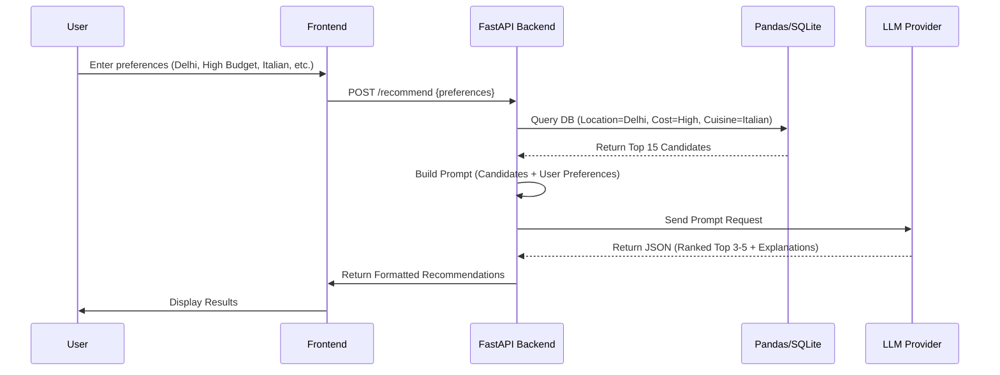

# System Architecture: AI-Powered Restaurant Recommendation System

## 1. Overview
This document outlines the architecture for an AI-powered restaurant recommendation service inspired by Zomato. The system intelligently suggests restaurants based on user preferences by combining structured data filtering with a Large Language Model (LLM) for reasoning, ranking, and generating human-like explanations.

## 2. High-Level Architecture

The architecture follows a standard client-server model, utilizing a Python-based backend for data processing and LLM orchestration, making it easy to interact with the Hugging Face dataset and AI models.

## 3. Recommended Technology Stack
Given the requirements to process data and integrate with LLMs, a Python-centric stack is highly recommended.

- **Frontend (UI)**: Streamlit (for rapid prototyping) or React/Next.js (for a production-grade web app).
- **Backend API**: FastAPI (Python) - Provides high performance, async support, and easy data validation.
- **Data Manipulation**: Pandas or DuckDB for fast in-memory querying and filtering.
- **LLM Orchestration**: LangChain or native SDKs (e.g., Groq Python SDK).
- **Data Source**: Hugging Face `datasets` library.

## 4. System Components

### 4.1. Data Ingestion & Preprocessing
*   **Source**: `ManikaSaini/zomato-restaurant-recommendation` from Hugging Face.
*   **Process**:
    *   Load dataset on application startup or via a scheduled job.
    *   Normalize categorical data (e.g., bucket cost into low/medium/high).
    *   Clean missing values and standardize text (e.g., locations, cuisines).
    *   Load into an efficient querying engine (e.g., an in-memory SQLite database or Pandas DataFrame).

### 4.2. User Interface Layer
Responsible for capturing:
*   **Hard constraints**: Location, Budget tier, Specific Cuisine, Minimum Rating.
*   **Soft constraints**: Additional preferences (e.g., "Good for dates", "Quiet atmosphere", "Fast service").
Responsible for rendering:
*   A clean list of recommendations containing: Name, Cuisine, Rating, Cost, and the AI-generated explanation.

### 4.3. Backend Integration Layer
Acts as the orchestrator for the recommendation workflow:
1.  **Parse Request**: Validates user inputs.
2.  **Pre-filtering**: It is inefficient and expensive to pass the entire dataset to an LLM. This component executes a query against the Data Store using the *hard constraints* to narrow down the dataset to a top `N` candidate list (e.g., 10-20 restaurants).
3.  **Data Serialization**: Converts the candidate records into a compressed JSON or Markdown table format to be injected into the LLM prompt.

### 4.4. Recommendation Engine (LLM Layer)
Takes the pre-filtered list and the user's *soft constraints* to produce the final recommendation.
*   **Prompt Construction**: Injects the serialized candidate data and user preferences into a carefully crafted prompt.
*   **LLM Execution**: Sends the prompt to the LLM via Groq (e.g., Llama 3).
*   **Structured Output Parsing**: Ensures the LLM returns data in a predictable format (e.g., JSON schema) so the backend can reliably parse the ranked restaurants and explanations.

## 5. Sequence Diagram Workflow

## 6. Prompt Engineering Strategy
To ensure consistent and high-quality outputs, the LLM prompt should be structured using the following sections:

1.  **System Prompt**: Define the persona (e.g., *"You are an expert food critic and personalized restaurant concierge."*).
2.  **Task Instruction**: Clearly state the objective (*"Review the provided list of candidate restaurants and select the best matches for the user based on their preferences."*).
3.  **User Preferences**: Inject the exact preferences provided by the user.
4.  **Context (Data)**: Provide the JSON array or CSV string of the pre-filtered candidate restaurants.
5.  **Output Formatting**: Provide strict instructions or a JSON schema to ensure the model returns structured data (e.g., demanding specific keys like `restaurant_id`, `name`, `explanation`, `rank`).
